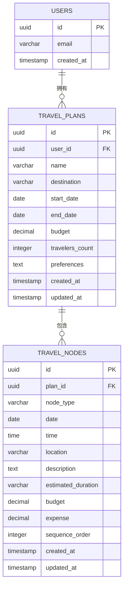

# Web版AI旅行规划师 (AI Travel Planner) 数据库设计文档

## 1. 数据库概述

Web版AI旅行规划师使用Supabase作为数据存储解决方案，Supabase基于PostgreSQL提供了强大的关系型数据库功能和认证服务。本设计文档详细描述了系统所需的数据库表结构、字段定义、关系约束和索引设计等。

## 2. 数据库表结构

### 2.1 用户表 (users)

> 注：此表由Supabase Authentication服务自动创建和管理，以下为主要字段说明。

| 字段名 | 数据类型 | 约束 | 描述 |
|-------|---------|------|------|
| `id` | `uuid` | `PRIMARY KEY` | 用户唯一标识符 |
| `email` | `varchar(255)` | `UNIQUE NOT NULL` | 用户邮箱 |
| `email_confirmed_at` | `timestamp` | `NULL` | 邮箱确认时间 |
| `password_hash` | `varchar(255)` | `NOT NULL` | 密码哈希值 |
| `created_at` | `timestamp` | `NOT NULL DEFAULT CURRENT_TIMESTAMP` | 账户创建时间 |
| `updated_at` | `timestamp` | `NOT NULL DEFAULT CURRENT_TIMESTAMP` | 账户更新时间 |
| `last_sign_in_at` | `timestamp` | `NULL` | 最后登录时间 |

### 2.2 旅行计划表 (travel_plans)

| 字段名 | 数据类型 | 约束 | 描述 |
|-------|---------|------|------|
| `id` | `uuid` | `PRIMARY KEY DEFAULT gen_random_uuid()` | 旅行计划唯一标识符 |
| `user_id` | `uuid` | `REFERENCES users(id) ON DELETE CASCADE` | 所属用户ID |
| `name` | `varchar(255)` | `NOT NULL` | 旅行计划名称 |
| `destination` | `varchar(255)` | `NOT NULL` | 旅行目的地 |
| `start_date` | `date` | `NOT NULL` | 旅行开始日期 |
| `end_date` | `date` | `NOT NULL` | 旅行结束日期 |
| `budget` | `decimal(12,2)` | `NOT NULL DEFAULT 0` | 旅行总预算（人民币） |
| `travelers_count` | `integer` | `NOT NULL DEFAULT 1` | 同行人数 |
| `preferences` | `text` | `NULL` | 旅行偏好描述 |
| `is_active` | `boolean` | `NOT NULL DEFAULT true` | 计划是否有效 |
| `created_at` | `timestamp` | `NOT NULL DEFAULT CURRENT_TIMESTAMP` | 创建时间 |
| `updated_at` | `timestamp` | `NOT NULL DEFAULT CURRENT_TIMESTAMP` | 更新时间 |

**索引设计**：
- 在 `user_id` 字段上创建索引，加速用户相关查询
- 在 `created_at` 字段上创建索引，优化按时间排序的查询

**触发器**：
- 创建 `update_timestamp` 触发器，在更新记录时自动更新 `updated_at` 字段

### 2.3 旅行节点表 (travel_nodes)

| 字段名 | 数据类型 | 约束 | 描述 |
|-------|---------|------|------|
| `id` | `uuid` | `PRIMARY KEY DEFAULT gen_random_uuid()` | 旅行节点唯一标识符 |
| `plan_id` | `uuid` | `REFERENCES travel_plans(id) ON DELETE CASCADE` | 所属旅行计划ID |
| `node_type` | `varchar(50)` | `NOT NULL CHECK (node_type IN ('餐饮', '景点', '住宿', '交通'))` | 节点类型 |
| `date` | `date` | `NOT NULL` | 节点日期 |
| `time` | `time` | `NULL` | 节点时间 |
| `location` | `varchar(255)` | `NOT NULL` | 地点 |
| `description` | `text` | `NULL` | 节点描述 |
| `estimated_duration` | `varchar(100)` | `NULL` | 预计花费时间 |
| `budget` | `decimal(10,2)` | `NOT NULL DEFAULT 0` | 预算费用（人民币） |
| `expense` | `decimal(10,2)` | `NOT NULL DEFAULT 0` | 实际费用（人民币） |
| `expense_notes` | `text` | `NULL` | 费用备注 |
| `sequence_order` | `integer` | `NOT NULL DEFAULT 0` | 节点在计划中的顺序 |
| `created_at` | `timestamp` | `NOT NULL DEFAULT CURRENT_TIMESTAMP` | 创建时间 |
| `updated_at` | `timestamp` | `NOT NULL DEFAULT CURRENT_TIMESTAMP` | 更新时间 |

**索引设计**：
- 在 `plan_id` 字段上创建索引，加速按计划查询节点
- 在 `(plan_id, date, sequence_order)` 字段上创建复合索引，优化按日期和顺序查询
- 在 `node_type` 字段上创建索引，优化按类型筛选

**触发器**：
- 创建 `update_timestamp` 触发器，在更新记录时自动更新 `updated_at` 字段

## 3. 表关系图



## 4. 数据完整性约束

### 4.1 主键约束
- 所有表都有主键，确保记录的唯一性
- 使用UUID作为主键类型，提供更好的安全性和分布式系统兼容性

### 4.2 外键约束
- `travel_plans.user_id` 关联到 `users.id`，确保每个旅行计划都属于一个有效用户
- `travel_nodes.plan_id` 关联到 `travel_plans.id`，确保每个节点都属于一个有效计划
- 使用 `ON DELETE CASCADE`，当父记录删除时，自动删除相关的子记录，保持数据一致性

### 4.3 检查约束
- `travel_nodes.node_type` 限制为预定义的四种类型："餐饮"、"景点"、"住宿"、"交通"
- 可以添加额外的检查约束，如 `start_date <= end_date` 确保日期逻辑正确

### 4.4 非空约束
- 关键字段（如 `name`, `destination`, `node_type` 等）设置为非空
- 费用相关字段默认值为0，避免空值带来的计算问题

## 5. 数据访问与安全

### 5.1 Supabase Row Level Security (RLS)
- 为所有用户相关的表启用行级安全策略
- 实现策略确保用户只能访问和修改自己的数据

#### 为 travel_plans 表配置的RLS策略示例：
```sql
-- 启用RLS
ALTER TABLE travel_plans ENABLE ROW LEVEL SECURITY;

-- 创建策略：用户只能查看自己的旅行计划
CREATE POLICY "User can view their own travel plans" 
    ON travel_plans 
    FOR SELECT 
    USING (auth.uid() = user_id);

-- 创建策略：用户只能创建自己的旅行计划
CREATE POLICY "User can create their own travel plans" 
    ON travel_plans 
    FOR INSERT 
    WITH CHECK (auth.uid() = user_id);

-- 创建策略：用户只能更新自己的旅行计划
CREATE POLICY "User can update their own travel plans" 
    ON travel_plans 
    FOR UPDATE 
    USING (auth.uid() = user_id);

-- 创建策略：用户只能删除自己的旅行计划
CREATE POLICY "User can delete their own travel plans" 
    ON travel_plans 
    FOR DELETE 
    USING (auth.uid() = user_id);
```

#### 为 travel_nodes 表配置的RLS策略示例：
```sql
-- 启用RLS
ALTER TABLE travel_nodes ENABLE ROW LEVEL SECURITY;

-- 创建策略：用户只能查看自己旅行计划中的节点
CREATE POLICY "User can view their own travel nodes" 
    ON travel_nodes 
    FOR SELECT 
    USING (auth.uid() IN (SELECT user_id FROM travel_plans WHERE travel_plans.id = plan_id));

-- 创建策略：用户只能更新自己旅行计划中的节点
CREATE POLICY "User can update their own travel nodes" 
    ON travel_nodes 
    FOR UPDATE 
    USING (auth.uid() IN (SELECT user_id FROM travel_plans WHERE travel_plans.id = plan_id));
```

### 5.2 敏感数据处理
- 用户密码通过Supabase Authentication自动进行哈希处理
- 不存储任何API密钥或敏感配置信息在数据库中
- 费用相关数据视为敏感信息，通过RLS严格控制访问权限

## 6. 查询优化

### 6.1 索引优化
- 对频繁查询的字段创建索引，如用户ID、计划ID、日期等
- 为常用的查询条件组合创建复合索引
- 避免在低基数列上创建索引

### 6.2 视图设计
为常用的查询模式创建视图，简化应用层查询逻辑：

#### 用户旅行计划概览视图：
```sql
CREATE VIEW user_plan_overview AS
SELECT 
    tp.id,
    tp.user_id,
    tp.name,
    tp.destination,
    tp.start_date,
    tp.end_date,
    tp.budget,
    COUNT(tn.id) AS node_count,
    SUM(tn.budget) AS total_node_budget,
    SUM(tn.expense) AS total_expense,
    tp.created_at,
    tp.updated_at
FROM 
    travel_plans tp
LEFT JOIN 
    travel_nodes tn ON tp.id = tn.plan_id
GROUP BY 
    tp.id;
```

#### 每日费用汇总视图：
```sql
CREATE VIEW daily_expense_summary AS
SELECT 
    tp.id AS plan_id,
    tn.date,
    tn.node_type,
    SUM(tn.budget) AS budget_sum,
    SUM(tn.expense) AS expense_sum
FROM 
    travel_plans tp
JOIN 
    travel_nodes tn ON tp.id = tn.plan_id
GROUP BY 
    tp.id, tn.date, tn.node_type;
```

## 7. 数据备份与恢复

- 利用Supabase提供的自动备份功能，定期备份数据库
- 建立数据恢复策略，确保在发生数据丢失时能够快速恢复
- 定期测试备份的完整性和可恢复性

## 8. 扩展考虑

### 8.1 未来可能的表扩展
- **用户偏好表**：存储用户的旅行偏好设置，如常用旅行方式、住宿偏好等
- **旅行照片表**：存储与旅行节点关联的照片
- **评论和评分表**：允许用户对景点、餐厅等进行评论和评分
- **共享计划表**：支持旅行计划的共享功能

### 8.2 性能扩展考虑
- 当数据量增大时，考虑对历史数据进行归档
- 根据查询模式，优化索引设计
- 对于复杂查询，考虑使用物化视图

## 9. 迁移脚本

提供初始表结构创建的SQL脚本，便于环境搭建：

```sql
-- 创建旅行计划表
CREATE TABLE travel_plans (
    id UUID PRIMARY KEY DEFAULT gen_random_uuid(),
    user_id UUID REFERENCES auth.users(id) ON DELETE CASCADE,
    name VARCHAR(255) NOT NULL,
    destination VARCHAR(255) NOT NULL,
    start_date DATE NOT NULL,
    end_date DATE NOT NULL,
    budget DECIMAL(12,2) NOT NULL DEFAULT 0,
    travelers_count INTEGER NOT NULL DEFAULT 1,
    preferences TEXT,
    is_active BOOLEAN NOT NULL DEFAULT true,
    created_at TIMESTAMP NOT NULL DEFAULT CURRENT_TIMESTAMP,
    updated_at TIMESTAMP NOT NULL DEFAULT CURRENT_TIMESTAMP
);

-- 创建旅行节点表
CREATE TABLE travel_nodes (
    id UUID PRIMARY KEY DEFAULT gen_random_uuid(),
    plan_id UUID REFERENCES travel_plans(id) ON DELETE CASCADE,
    node_type VARCHAR(50) NOT NULL CHECK (node_type IN ('餐饮', '景点', '住宿', '交通')),
    date DATE NOT NULL,
    time TIME,
    location VARCHAR(255) NOT NULL,
    description TEXT,
    budget DECIMAL(10,2) NOT NULL DEFAULT 0,
    expense DECIMAL(10,2) NOT NULL DEFAULT 0,
    expense_notes TEXT,
    sequence_order INTEGER NOT NULL DEFAULT 0,
    created_at TIMESTAMP NOT NULL DEFAULT CURRENT_TIMESTAMP,
    updated_at TIMESTAMP NOT NULL DEFAULT CURRENT_TIMESTAMP
);

-- 创建索引
CREATE INDEX idx_travel_plans_user_id ON travel_plans(user_id);
CREATE INDEX idx_travel_plans_created_at ON travel_plans(created_at);
CREATE INDEX idx_travel_nodes_plan_id ON travel_nodes(plan_id);
CREATE INDEX idx_travel_nodes_plan_date_order ON travel_nodes(plan_id, date, sequence_order);
CREATE INDEX idx_travel_nodes_type ON travel_nodes(node_type);

-- 创建更新时间触发器函数
CREATE OR REPLACE FUNCTION update_modified_column()
RETURNS TRIGGER AS $$
BEGIN
    NEW.updated_at = CURRENT_TIMESTAMP;
    RETURN NEW;
END;
$$ language 'plpgsql';

-- 为旅行计划表创建触发器
CREATE TRIGGER update_travel_plans_modtime
    BEFORE UPDATE ON travel_plans
    FOR EACH ROW
    EXECUTE FUNCTION update_modified_column();

-- 为旅行节点表创建触发器
CREATE TRIGGER update_travel_nodes_modtime
    BEFORE UPDATE ON travel_nodes
    FOR EACH ROW
    EXECUTE FUNCTION update_modified_column();

-- 启用RLS并设置策略（在Supabase控制台中执行）
-- ALTER TABLE travel_plans ENABLE ROW LEVEL SECURITY;
-- ALTER TABLE travel_nodes ENABLE ROW LEVEL SECURITY;
```

## 10. 注意事项

1. 所有与Supabase的交互都应通过官方SDK或API进行，避免直接操作数据库连接
2. 敏感配置信息（如数据库连接字符串）应通过环境变量管理
3. 定期审查数据库访问日志，监控异常访问
4. 考虑数据量增长对性能的影响，适时调整索引和查询策略
5. 确保所有数据库操作都在事务中进行，保持数据一致性