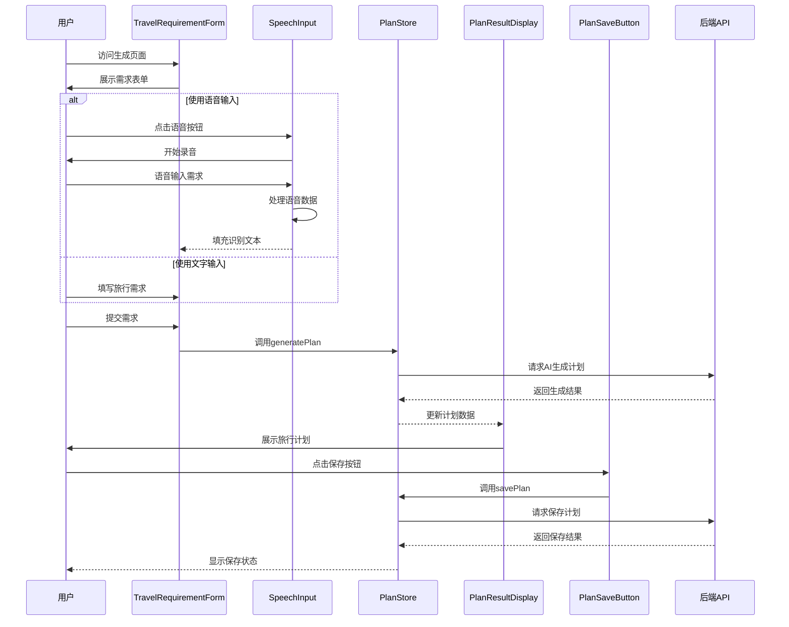
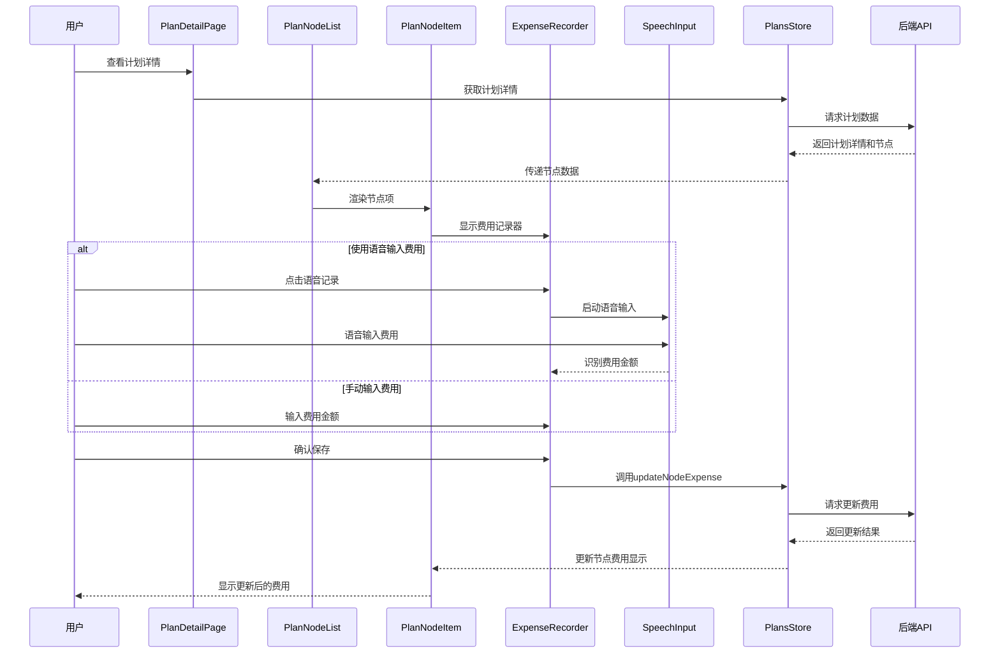

# Web版AI旅行规划师 (AI Travel Planner) 组件/模块设计文档

## 1. 组件架构概述

Web版AI旅行规划师的前端采用Vue.js 3框架构建，遵循组件化开发理念。本设计文档详细描述系统的组件结构、组件职责、组件间交互以及状态管理方案。

### 1.1 整体组件结构

系统采用分层架构设计，组件结构如下：

```
App.vue
├── 布局组件 (Layout)
│   ├── Header.vue
│   ├── Footer.vue
│   └── MainContent.vue
├── 页面组件 (Pages)
│   ├── 认证页面
│   │   ├── LoginPage.vue
│   │   └── RegisterPage.vue
│   ├── 旅行规划页面
│   │   └── TravelPlanGeneratorPage.vue
│   └── 计划管理页面
│       ├── PlanListPage.vue
│       └── PlanDetailPage.vue
├── 业务组件 (Components)
│   ├── 认证相关
│   │   ├── LoginForm.vue
│   │   ├── RegisterForm.vue
│   │   └── AuthStatus.vue
│   ├── 旅行规划相关
│   │   ├── TravelRequirementForm.vue
│   │   ├── PlanResultDisplay.vue
│   │   └── PlanSaveButton.vue
│   ├── 计划管理相关
│   │   ├── PlanCard.vue
│   │   ├── PlanNodeList.vue
│   │   ├── PlanNodeItem.vue
│   │   └── ExpenseRecorder.vue
│   └── 语音识别相关
│       ├── SpeechInput.vue
│       ├── AudioRecorder.vue
│       └── SpeechButton.vue
└── 基础组件 (Base)
    ├── Button.vue
    ├── Input.vue
    ├── Card.vue
    ├── Loading.vue
    ├── Notification.vue
    └── Modal.vue
```

## 2. 核心组件详细设计

### 2.1 认证模块组件

#### 2.1.1 LoginForm.vue

**功能职责**：提供用户登录表单，处理登录逻辑。

**属性 (Props)**：
- `redirectTo` (String)：登录成功后重定向的路径，默认 `/plan-generator`

**事件 (Events)**：
- `login-success`：登录成功时触发
- `login-error`：登录失败时触发，传递错误信息

**内部状态 (State)**：
- `email` (String)：用户输入的邮箱
- `password` (String)：用户输入的密码
- `isLoading` (Boolean)：登录请求是否正在处理
- `error` (String)：错误信息

**主要方法**：
- `validateForm()`：验证表单输入
- `handleSubmit()`：处理表单提交，调用登录API
- `resetForm()`：重置表单

#### 2.1.2 RegisterForm.vue

**功能职责**：提供用户注册表单，处理注册逻辑。

**属性 (Props)**：无

**事件 (Events)**：
- `register-success`：注册成功时触发
- `register-error`：注册失败时触发，传递错误信息

**内部状态 (State)**：
- `email` (String)：用户输入的邮箱
- `password` (String)：用户输入的密码
- `confirmPassword` (String)：确认密码
- `isLoading` (Boolean)：注册请求是否正在处理
- `error` (String)：错误信息

**主要方法**：
- `validateForm()`：验证表单输入
- `handleSubmit()`：处理表单提交，调用注册API
- `resetForm()`：重置表单

### 2.2 旅行规划模块组件

#### 2.2.1 TravelRequirementForm.vue

**功能职责**：收集用户的旅行需求，包括目的地、日期、预算等信息。

**属性 (Props)**：无

**事件 (Events)**：
- `requirements-submit`：提交旅行需求时触发，传递需求数据

**内部状态 (State)**：
- `destination` (String)：目的地
- `startDate` (Date)：开始日期
- `endDate` (Date)：结束日期
- `budget` (Number)：预算
- `travelersCount` (Number)：同行人数
- `preferences` (String)：旅行偏好

**主要方法**：
- `validateForm()`：验证表单输入
- `handleSubmit()`：处理表单提交
- `resetForm()`：重置表单

#### 2.2.2 SpeechInput.vue

**功能职责**：提供语音输入功能，集成科大讯飞语音识别API。

**属性 (Props)**：
- `placeholder` (String)：输入框占位符
- `value` (String)：绑定的文本值（支持v-model）
- `language` (String)：识别语言，默认为'zh_cn'

**事件 (Events)**：
- `input`：识别到文本时触发
- `speech-start`：开始录音时触发
- `speech-end`：结束录音时触发
- `error`：发生错误时触发

**内部状态 (State)**：
- `isRecording` (Boolean)：是否正在录音
- `isProcessing` (Boolean)：是否正在处理语音

**主要方法**：
- `startRecording()`：开始录音
- `stopRecording()`：停止录音
- `processAudio()`：处理录音数据，调用语音识别API
- `handleSpeechResult()`：处理语音识别结果

#### 2.2.3 PlanResultDisplay.vue

**功能职责**：展示AI生成的旅行计划详情。

**属性 (Props)**：
- `planData` (Object)：旅行计划数据
- `loading` (Boolean)：是否正在加载

**事件 (Events)**：无

**内部状态 (State)**：无（纯展示组件）

**主要方法**：
- `formatDate(date)`：格式化日期显示
- `formatCurrency(amount)`：格式化货币显示

### 2.3 计划管理模块组件

#### 2.3.1 PlanCard.vue

**功能职责**：在计划列表中展示单个旅行计划的卡片。

**属性 (Props)**：
- `plan` (Object)：旅行计划数据

**事件 (Events)**：
- `view-detail`：点击查看详情时触发
- `delete`：点击删除时触发

**内部状态 (State)**：无

**主要方法**：
- `handleViewDetail()`：处理查看详情事件
- `handleDelete()`：处理删除事件

#### 2.3.2 PlanNodeList.vue

**功能职责**：展示旅行计划的所有节点列表。

**属性 (Props)**：
- `nodes` (Array)：旅行节点数组
- `planId` (String)：所属计划ID

**事件 (Events)**：
- `expense-updated`：费用更新时触发

**内部状态 (State)**：无

**主要方法**：
- `groupNodesByDate()`：按日期对节点进行分组
- `calculateDailyTotals(date, nodes)`：计算每日预算和实际费用总计

#### 2.3.3 PlanNodeItem.vue

**功能职责**：展示单个旅行节点的详细信息。

**属性 (Props)**：
- `node` (Object)：旅行节点数据，包含预计花费时间属性

**事件 (Events)**：
- `update-expense`：更新费用时触发

**内部状态 (State)**：无

**主要方法**：
- `getNodeIcon(type)`：根据节点类型返回对应的图标
- `getNodeColor(type)`：根据节点类型返回对应的颜色
- `formatDuration(duration)`：格式化预计花费时间的显示

#### 2.3.4 ExpenseRecorder.vue

**功能职责**：提供费用记录输入功能。

**属性 (Props)**：
- `nodeId` (String)：旅行节点ID
- `currentExpense` (Number)：当前记录的费用
- `editable` (Boolean)：是否可编辑，默认为true

**事件 (Events)**：
- `expense-changed`：费用变更时触发，传递新的费用金额

**内部状态 (State)**：
- `expense` (Number)：临时存储的费用
- `isEditing` (Boolean)：是否处于编辑状态
- `useSpeech` (Boolean)：是否使用语音输入

**主要方法**：
- `startEditing()`：开始编辑
- `saveExpense()`：保存费用
- `cancelEditing()`：取消编辑
- `handleSpeechInput()`：处理语音输入费用

## 3. 状态管理设计

使用Pinia进行状态管理，主要包括以下几个store：

### 3.1 AuthStore

**功能**：管理用户认证状态和用户信息。

**状态 (State)**：
- `user` (Object|null)：当前登录用户信息
- `isAuthenticated` (Boolean)：用户是否已认证
- `token` (String|null)：JWT token

**动作 (Actions)**：
- `login(email, password)`：用户登录
- `register(email, password)`：用户注册
- `logout()`：用户登出
- `fetchCurrentUser()`：获取当前用户信息
- `checkAuthStatus()`：检查认证状态

### 3.2 PlanStore

**功能**：管理旅行计划的生成和查看。

**状态 (State)**：
- `currentPlan` (Object|null)：当前生成的旅行计划
- `isGenerating` (Boolean)：是否正在生成计划
- `generationError` (String|null)：生成错误信息

**动作 (Actions)**：
- `generatePlan(requirements)`：生成旅行计划
- `savePlan(planData)`：保存旅行计划
- `clearCurrentPlan()`：清除当前计划

### 3.3 PlansStore

**功能**：管理用户的旅行计划列表。

**状态 (State)**：
- `plans` (Array)：用户的旅行计划列表
- `currentPlanDetail` (Object|null)：当前查看的计划详情
- `isLoading` (Boolean)：是否正在加载
- `error` (String|null)：错误信息
- `pagination` (Object)：分页信息

**动作 (Actions)**：
- `fetchPlans(page, pageSize)`：获取旅行计划列表
- `fetchPlanDetail(planId)`：获取计划详情
- `updatePlan(planId, planData)`：更新旅行计划
- `deletePlan(planId)`：删除旅行计划
- `updateNodeExpense(nodeId, expense)`：更新节点费用

### 3.4 SpeechStore

**功能**：管理语音识别相关状态。

**状态 (State)**：
- `isRecording` (Boolean)：是否正在录音
- `isProcessing` (Boolean)：是否正在处理语音
- `lastResult` (String|null)：上一次语音识别结果
- `error` (String|null)：错误信息

**动作 (Actions)**：
- `startSpeechRecognition()`：开始语音识别
- `stopSpeechRecognition()`：停止语音识别
- `processSpeechResult(result)`：处理语音识别结果
- `clearError()`：清除错误信息

## 4. 组件交互流程图

### 4.1 旅行计划生成流程



### 4.2 费用记录流程



## 5. 服务层设计

### 5.1 ApiService

**功能**：封装与后端API的通信，提供统一的数据请求接口。

**主要方法**：
- `request(config)`：基础请求方法
- `get(url, params)`：GET请求
- `post(url, data)`：POST请求
- `put(url, data)`：PUT请求
- `delete(url)`：DELETE请求
- `setAuthToken(token)`：设置认证token

**配置**：
- 基础URL配置
- 请求超时设置
- 请求/响应拦截器
- 错误处理

### 5.2 AuthService

**功能**：处理用户认证相关的API调用。

**主要方法**：
- `login(credentials)`：用户登录
- `register(userData)`：用户注册
- `getCurrentUser()`：获取当前用户信息
- `logout()`：用户登出

### 5.3 TravelPlanService

**功能**：处理旅行计划相关的API调用。

**主要方法**：
- `generatePlan(requirements)`：生成旅行计划
- `savePlan(planData)`：保存旅行计划
- `getPlans(page, pageSize)`：获取旅行计划列表
- `getPlanDetail(planId)`：获取计划详情
- `updatePlan(planId, planData)`：更新旅行计划
- `deletePlan(planId)`：删除旅行计划
- `updateNodeExpense(nodeId, expense)`：更新节点费用

### 5.4 SpeechRecognitionService

**功能**：处理语音识别相关的API调用和音频处理。

**主要方法**：
- `initialize()`：初始化语音识别服务
- `startRecognition()`：开始语音识别
- `stopRecognition()`：停止语音识别
- `processAudioData(audioData)`：处理音频数据
- `extractExpenseFromText(text)`：从文本中提取费用信息

## 6. 组件代码结构示例

### 6.1 TravelRequirementForm.vue 示例

```vue
<template>
  <div class="travel-requirement-form">
    <h2>请输入您的旅行需求</h2>
    
    <form @submit.prevent="handleSubmit">
      <!-- 目的地 -->
      <div class="form-group">
        <label for="destination">目的地</label>
        <input 
          id="destination" 
          v-model="destination" 
          type="text" 
          required 
          placeholder="例如：日本东京"
        />
      </div>
      
      <!-- 日期选择 -->
      <div class="form-row">
        <div class="form-group">
          <label for="startDate">开始日期</label>
          <input 
            id="startDate" 
            v-model="startDate" 
            type="date" 
            required 
          />
        </div>
        
        <div class="form-group">
          <label for="endDate">结束日期</label>
          <input 
            id="endDate" 
            v-model="endDate" 
            type="date" 
            required 
          />
        </div>
      </div>
      
      <!-- 预算和人数 -->
      <div class="form-row">
        <div class="form-group">
          <label for="budget">预算（元）</label>
          <input 
            id="budget" 
            v-model.number="budget" 
            type="number" 
            min="0" 
            required 
          />
        </div>
        
        <div class="form-group">
          <label for="travelersCount">同行人数</label>
          <input 
            id="travelersCount" 
            v-model.number="travelersCount" 
            type="number" 
            min="1" 
            required 
          />
        </div>
      </div>
      
      <!-- 旅行偏好 -->
      <div class="form-group">
        <label for="preferences">旅行偏好</label>
        <div class="speech-input-container">
          <textarea 
            id="preferences" 
            v-model="preferences" 
            rows="3" 
            placeholder="例如：喜欢美食和动漫，带孩子"
          ></textarea>
          <speech-button @result="handleSpeechResult" />
        </div>
      </div>
      
      <!-- 提交按钮 -->
      <button type="submit" class="submit-btn" :disabled="isSubmitting">
        {{ isSubmitting ? '生成中...' : '生成旅行计划' }}
      </button>
    </form>
  </div>
</template>

<script>
import { ref } from 'vue';
import SpeechButton from './SpeechButton.vue';

export default {
  name: 'TravelRequirementForm',
  components: {
    SpeechButton
  },
  emits: ['requirements-submit'],
  setup(props, { emit }) {
    const destination = ref('');
    const startDate = ref('');
    const endDate = ref('');
    const budget = ref(null);
    const travelersCount = ref(1);
    const preferences = ref('');
    const isSubmitting = ref(false);
    
    const validateForm = () => {
      // 表单验证逻辑
      if (!destination.value || !startDate.value || !endDate.value || !budget.value) {
        return false;
      }
      
      const start = new Date(startDate.value);
      const end = new Date(endDate.value);
      if (end < start) {
        alert('结束日期不能早于开始日期');
        return false;
      }
      
      return true;
    };
    
    const handleSubmit = async () => {
      if (!validateForm()) return;
      
      isSubmitting.value = true;
      
      try {
        const requirements = {
          destination: destination.value,
          startDate: startDate.value,
          endDate: endDate.value,
          budget: budget.value,
          travelersCount: travelersCount.value,
          preferences: preferences.value
        };
        
        emit('requirements-submit', requirements);
      } catch (error) {
        console.error('提交表单失败:', error);
      } finally {
        isSubmitting.value = false;
      }
    };
    
    const handleSpeechResult = (text) => {
      preferences.value = text;
    };
    
    return {
      destination,
      startDate,
      endDate,
      budget,
      travelersCount,
      preferences,
      isSubmitting,
      handleSubmit,
      handleSpeechResult
    };
  }
};
</script>

<style scoped>
/* 样式定义 */
</style>
```

## 7. 组件复用策略

### 7.1 组件设计原则
- **单一职责**：每个组件只负责一个功能点
- **可复用性**：设计通用组件，减少重复代码
- **可维护性**：清晰的组件结构和命名
- **可测试性**：组件设计便于单元测试

### 7.2 组件复用方式
- **基础组件库**：封装UI基础组件，如按钮、输入框、卡片等
- **业务组件库**：封装通用业务组件，如表单、列表、表格等
- **组合模式**：通过组件组合构建复杂功能
- **插槽机制**：使用Vue插槽增强组件灵活性

## 8. 性能优化策略

### 8.1 组件级优化
- **组件懒加载**：使用路由懒加载减少初始加载时间
- **虚拟滚动**：对长列表使用虚拟滚动，减少DOM节点数量
- **组件缓存**：使用 `<KeepAlive>` 缓存不频繁变化的组件
- **计算属性缓存**：合理使用计算属性避免重复计算

### 8.2 状态管理优化
- **细粒度的Store**：按功能划分Store，避免单一Store过大
- **避免不必要的状态更新**：合理设计状态结构，减少状态更新的影响范围
- **异步操作优化**：合理处理异步操作，避免阻塞UI

## 9. 部署与集成注意事项

### 9.1 组件库集成
- 使用Element Plus作为UI组件库，需要在main.js中进行全局配置
- 按需引入组件，减少打包体积

### 9.2 环境变量配置
- 所有API相关配置通过环境变量注入
- 不同环境（开发、测试、生产）使用不同的配置文件

### 9.3 构建优化
- 使用Vite进行构建，提高开发效率和构建性能
- 配置CDN加速静态资源访问
- 启用代码分割和tree-shaking优化打包结果

## 10. 总结

本组件/模块设计文档详细描述了Web版AI旅行规划师的前端组件结构、组件职责、状态管理和组件交互方案。通过组件化的设计，系统具有良好的可维护性、可扩展性和复用性。设计遵循Vue.js的最佳实践，采用组合式API，结合Pinia进行状态管理，确保系统的性能和用户体验。