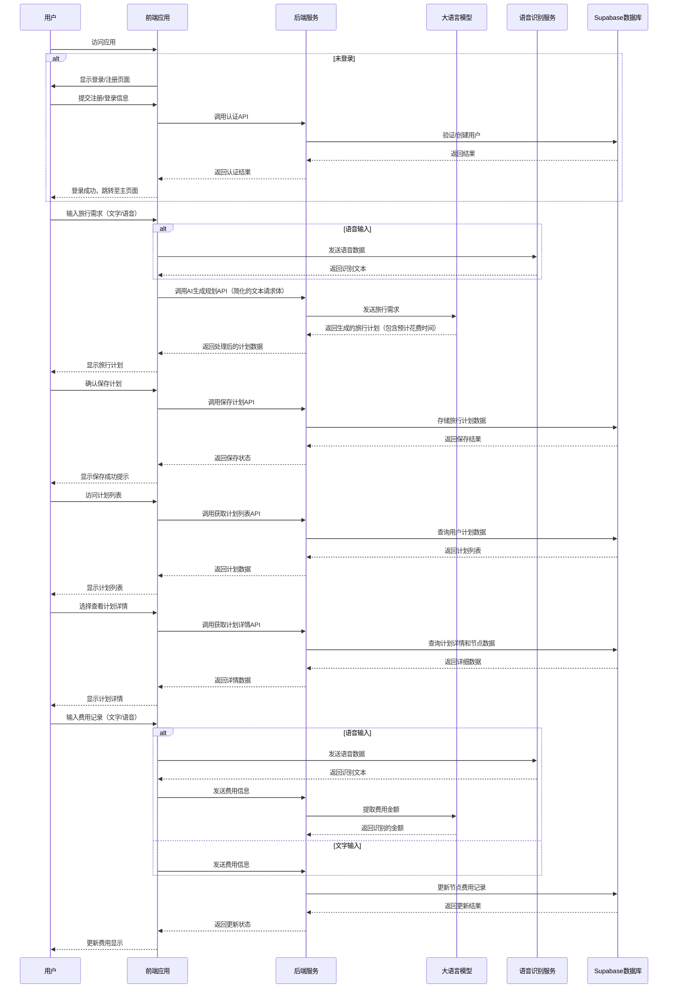

# Web版AI旅行规划师 (AI Travel Planner) 系统设计文档

## 1. 系统架构概述

### 1.1 整体架构
Web版AI旅行规划师采用前后端分离的架构设计，主要包含以下几个核心层次：

- **前端层**：使用Vue.js框架构建的单页应用（SPA），负责用户界面展示和交互。
- **后端服务层**：提供API接口，处理业务逻辑，与第三方服务和数据库交互。
- **第三方服务层**：包括语音识别API、大语言模型API等外部服务。
- **数据存储层**：使用Supabase提供的数据库服务，存储用户数据和旅行计划信息。

### 1.2 系统流程图

## 2. 技术栈选择

### 2.1 前端技术栈
- **框架**：Vue.js 3.x
- **状态管理**：Pinia
- **路由**：Vue Router
- **UI组件库**：Element Plus
- **HTTP客户端**：Axios
- **语音识别集成**：基于科大讯飞语音识别API（参考iat-js-demo）
- **构建工具**：Vite

### 2.2 后端技术栈
- **运行环境**：Node.js
- **Web框架**：Express.js 或 Koa.js
- **认证授权**：JWT (JSON Web Token)
- **第三方服务集成**：
  - 大语言模型API（阿里云百炼平台）
  - 语音识别API（科大讯飞）

### 2.3 数据存储
- **数据库服务**：Supabase（PostgreSQL）
- **认证服务**：Supabase Authentication

## 3. 模块设计

### 3.1 前端模块划分

#### 3.1.1 认证模块 (AuthModule)
- **功能**：处理用户注册、登录、登出等认证相关功能。
- **主要组件**：LoginView, RegisterView
- **状态管理**：authStore（用户登录状态、用户信息）
- **路由**：/login, /register

#### 3.1.2 旅行规划模块 (TravelPlanModule)
- **功能**：AI生成旅行计划、展示计划内容、保存计划。
- **主要组件**：TravelPlanGenerator, PlanViewer, PlanSaveButton
- **状态管理**：planStore（当前生成的计划数据）
- **路由**：/plan/generate, /plan/view

#### 3.1.3 计划管理模块 (PlanManagementModule)
- **功能**：展示用户所有旅行计划、查看详情、管理费用。
- **主要组件**：PlanList, PlanDetail, ExpenseRecorder
- **状态管理**：plansStore（用户计划列表）
- **路由**：/plans, /plans/:id

#### 3.1.4 语音识别模块 (SpeechRecognitionModule)
- **功能**：提供语音输入功能，集成科大讯飞API。
- **主要组件**：SpeechInput, AudioRecorder
- **服务**：speechService（处理语音录制和API调用）

#### 3.1.5 公共组件模块 (CommonModule)
- **功能**：提供通用组件和工具函数。
- **主要组件**：Header, Footer, LoadingSpinner, Notification
- **工具服务**：apiService, utilsService

### 3.2 后端模块划分

#### 3.2.1 认证服务 (AuthService)
- **功能**：处理用户注册、登录、JWT签发和验证。
- **API端点**：/api/auth/register, /api/auth/login, /api/auth/me
- **依赖**：Supabase Authentication

#### 3.2.2 旅行计划服务 (TravelPlanService)
- **功能**：处理旅行计划的生成、保存、查询和更新。
- **API端点**：
  - /api/plans/generate (生成计划)
  - /api/plans (获取计划列表)
  - /api/plans/:id (获取计划详情)
  - /api/plans (保存计划)
  - /api/plans/:id (更新计划)
  - /api/plans/:id (删除计划)
- **依赖**：Supabase Database, AI模型服务

#### 3.2.3 AI服务 (AIService)
- **功能**：封装对大语言模型API的调用，处理旅行计划生成和费用识别。
- **核心方法**：
  - generateTravelPlan(text)：接收简化的文本请求体，生成旅行计划，包含预计花费时间
  - extractExpenseAmount(text)
- **依赖**：大语言模型API

#### 3.2.4 费用管理服务 (ExpenseService)
- **功能**：处理旅行节点的费用记录和更新。
- **API端点**：/api/nodes/:id/expense
- **依赖**：Supabase Database, AIService

#### 3.2.5 语音识别代理服务 (SpeechRecognitionProxy)
- **功能**：作为前端和语音识别API之间的代理，处理语音数据转发和响应处理。
- **API端点**：/api/speech/recognize
- **依赖**：科大讯飞语音识别API

## 4. 数据库设计

### 4.1 表结构概览
系统将使用Supabase创建以下主要数据表：

- **users**：存储用户信息（Supabase Authentication会自动创建）
- **travel_plans**：存储旅行计划基本信息
- **travel_nodes**：存储旅行节点详细信息，包含预计花费时间字段

详细的数据库设计请参考《数据库设计文档》。

## 5. API集成设计

### 5.1 大语言模型API集成
- **服务提供商**：阿里云百炼平台
- **模型选择**：qwen-plus
- **调用方式**：HTTP REST API
- **主要用途**：生成旅行计划、解析费用信息
- **安全性考虑**：API密钥通过环境变量管理，不在代码中硬编码

### 5.2 语音识别API集成
- **服务提供商**：科大讯飞
- **集成方式**：前端直接集成（参考iat-js-demo）
- **主要用途**：旅行需求语音输入、费用记录语音输入
- **安全性考虑**：API密钥通过环境变量管理，不在代码中硬编码

## 6. 安全性设计

### 6.1 用户认证与授权
- 使用JWT进行身份验证，token设置合理的过期时间
- 所有需要授权的API端点必须验证JWT有效性
- 用户只能访问和修改自己的数据

### 6.2 数据安全
- 敏感数据（如密码）加密存储
- API密钥通过环境变量管理，不提交到代码仓库
- 前端不直接暴露数据库连接信息

### 6.3 传输安全
- 使用HTTPS协议进行数据传输
- API请求添加适当的请求头和签名验证

## 7. 性能优化设计

### 7.1 前端优化
- 组件懒加载和代码分割，减少初始加载时间
- 静态资源缓存策略
- 图片和媒体资源优化

### 7.2 后端优化
- API响应缓存
- 数据库查询优化（索引、连接优化）
- 异步处理耗时操作（如AI生成计划）

### 7.3 第三方服务调用优化
- 实现重试机制，提高API调用稳定性
- 缓存频繁使用的AI生成结果（如果适用）
- 合理设置请求超时时间

## 8. 扩展性设计

### 8.1 模块化架构
系统采用高度模块化设计，各功能模块之间通过明确的接口通信，便于后续功能扩展和维护。

### 8.2 插件化支持
核心功能设计为可插拔式，允许未来添加新的功能模块或替换现有模块。

### 8.3 API版本控制
API设计考虑版本控制，便于未来接口升级和向后兼容。

## 9. 部署与运维考虑

### 9.1 部署架构
- 前端应用：静态文件部署到CDN或云存储
- 后端服务：部署到云服务器或容器服务
- 数据库：使用Supabase托管服务

### 9.2 环境变量管理
所有敏感配置（如API密钥、数据库连接信息）通过环境变量管理，不同环境（开发、测试、生产）使用不同的环境变量配置。

### 9.3 日志与监控
- 实现详细的日志记录系统
- 监控系统性能和错误率
- 设置关键指标的告警机制

## 10. 风险评估与应对策略

### 10.1 第三方服务依赖风险
- **风险**：依赖的大语言模型API或语音识别API可能服务中断或性能下降
- **应对策略**：实现服务降级机制，提供备用方案，监控服务状态

### 10.2 数据安全风险
- **风险**：用户数据泄露或未授权访问
- **应对策略**：严格的认证授权机制，数据加密，定期安全审计

### 10.3 性能风险
- **风险**：AI生成计划过程耗时较长，影响用户体验
- **应对策略**：实现异步处理，提供进度反馈，优化API调用